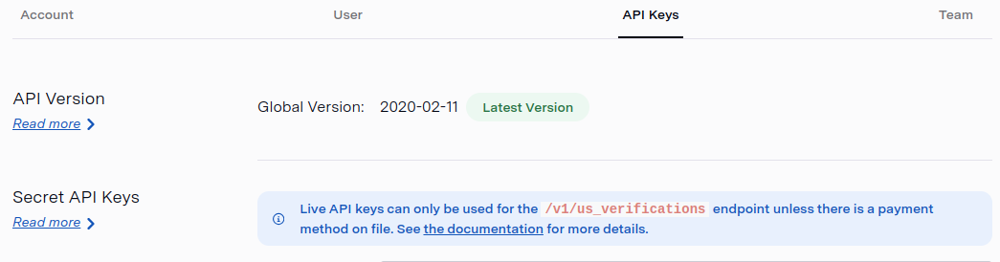

## Challenge 1
## Simple API integration and data output through an endpoint.  
- Input: Part of a real address in the US. City, state and zipCode as optional values. 
- Output: Complete addresses, containing City, State and ZipCode. 
- SDK: https://github.com/lob/lob-java
- ENDPOINT: https://docs.lob.com/#operation/autocompletion
- Postman: export the collection/request used to call the endpoint and put it into the `/postman` directory.

## Solution 

### Documentation
Utilize Swagger to document under ```/schema/AddressSchema.yml```

### Test app
The solution is deployed on real server. URL and credentials will be provided to try it. 
- URL: Provided 
- USERNAME: Provided
- PASSWORD: Provided 

### Limit
Since the API key is limited to the ```/v1/us_verifications```  endpoint, I've set up two endpoints: one using actual data 
and the other with mock data. Both endpoints serve the same purpose, but they draw from different data sources.

Here the screenshot

)


